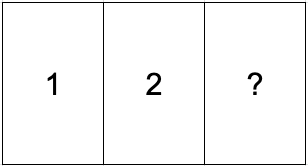
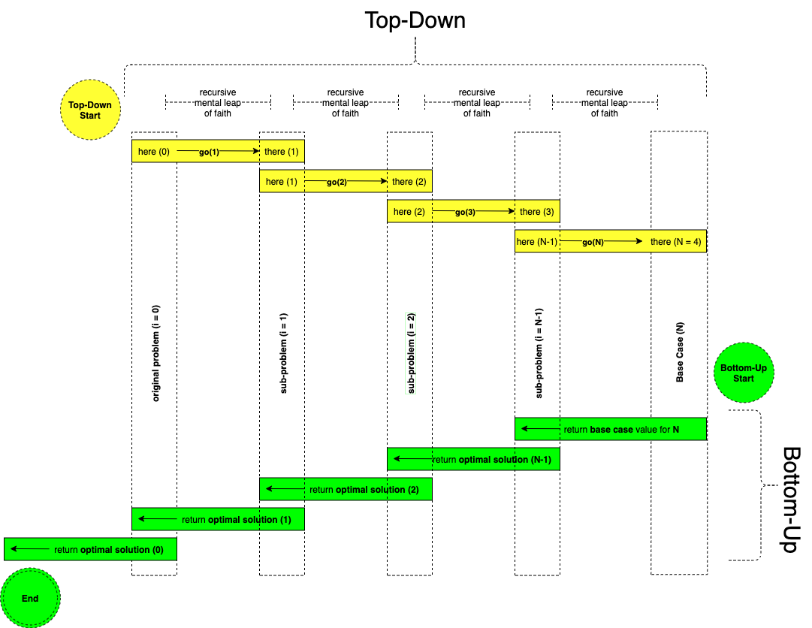

# 🎨  The ART of Dynamic Programming
## An Intuitive Approach: From Apprentice to Master

> When I left you, I was but the learner, now I am the master.
>
[-Darth Vader](https://en.wikipedia.org/wiki/Darth_Vader)

Let us explore the intuitions of dynamic programming and transform our thoughts from "what the hell?" to "oh yeah, duh!" via a 3-step heuristic process.  In hindsight, we can "see" the **ART** of dynamic programming is as easy as 1, 2, 3. 👍

## Prerequisites

> You rarely have time for everything you want in this life, so you need to make choices. And hopefully your choices can come from a deep sense of who you are.
>
[-Mr. Rogers](https://en.wikipedia.org/wiki/Fred_Rogers)

A significant amount of time and mental resources are necessary to begin understanding dynamic programming.  Thus, DP is best approached as a "marathon", not a "sprint."  Two key building blocks towards a basic understanding of DP are [recursion](https://en.wikipedia.org/wiki/Recursion_(computer_science)) and [mathematical induction](https://en.wikipedia.org/wiki/Mathematical_induction).

**Note:** When I mention "recursive stack unwinding" below, what I mean is "frames popping off the recursive [call stack](https://en.wikipedia.org/wiki/Call_stack)".  And I imagine a similarity between this action and stepping down the stairs one-by-one, followed by stepping back up the stairs  one-by-one in reverse.  Stepping down the stairs would be equivalent to the recursive function being invoked as a subroutine of itself.  And stepping back up the stairs would be equivalent to the recursive function invocations exiting their subroutines as the base case(s) are reached.

> Take the first step in faith. You don't have to see the whole staircase, just take the first step.
>
[-Martin Luther King Jr.](https://en.wikipedia.org/wiki/Martin_Luther_King_Jr.)

A mental leap of faith is necessary to begin post-processing [recursion](https://en.wikipedia.org/wiki/Recursion_(computer_science)) and [mathematical induction](https://en.wikipedia.org/wiki/Mathematical_induction), ie. we can only understand the basic principles of recursion and recursive algorithms after we have assumed the inductive hypothesis of a recurrence relation is true.  After taking this mental leap of faith, we can look back in hindsight with the mind's eye to discover what that actually means, ie. we can clearly "see" the recursive stack hit the base case(s) and begin to unwind, formulating an optimal solution built upon the optimal solutions to subproblems of the original problem itself.

## What is Dynamic Programming?

> We will never know our full potential unless we push ourselves to find it.
>
[-Travis Rice](https://en.wikipedia.org/wiki/Travis_Rice)

There are two key ingredients to problems which can be solved by a [Dynamic Programming](https://en.wikipedia.org/wiki/Dynamic_programming) algorithm:
1. [Optimal Substructure](https://en.wikipedia.org/wiki/Optimal_substructure)
2. [Overlapping Subproblems](https://en.wikipedia.org/wiki/Overlapping_subproblems)

## What is the ART of Dynamic Programming?

> Don't only practice your art, but force your way into its secrets.  For it and knowledge can raise men to the divine.
>
[-Ludwig van Beethoven](https://en.wikipedia.org/wiki/Ludwig_van_Beethoven)

**ART** is an acronym used to intuitively create solutions to DP problems in 3 steps:
1. **A**ll
2. **R**emember
3. **T**urn

These 3 steps are elaborated upon below, however, let us first take a minute to consider our end-goal, and how we can intuitively reach it.  Our end-goal is to minimize or maximize an objective function within the given constraints of an arbitrary universe of discourse (ie. the problem statement).

**Ask yourself this question:** Is it possible to know the minimum or maximum objective function outcome without considering all possibilities?  For example, let's say we have 3 numbers, and we want to know what is the minimum or maximum of those 3 numbers.  Is it possible to know the minimum or maximum value *without* considering <b>all</b> of the numbers?  Please take a moment to consider this question before proceeding.

See Answer

The answer is obviously "no."  It is <i>not</i> possible to know which of the 3 numbers are minimal or maximal unless we consider all 3 values.  Using 3 cards as an example, let's assume we only know the values for the first two cards.  Since we have <i>not</i> seen the third card's value, we don't know if it's less-than, equal-to, or greater-than the first two cards, and thus we <i>cannot</i> determine the objective function outcome <i>without</i> considering <b>all</b> of the card values.

### Step 1: All

**A**ll possibilities of a universe of discourse under consideration need to be checked before we can determine the objective function outcome.  This realization allows us to begin creating a DP solution via a naive [brute-force algorithm](https://en.wikipedia.org/wiki/Brute-force_search) ie. an exhaustive search of all possibilities.  Therefore, we begin by exploring all possibilites via top-down [depth-first-search](https://en.wikipedia.org/wiki/Depth-first_search).  Since we know we need to check all possibilities, this gives us key insight towards the N-dimensions of the corresponding DP memo which is used to remember the optimal solutions to each overlapping subproblem.  This intuition leads us to step 2, but before we move on to step 2, let us first take another moment to consider the next key question.

**Ask yourself this question:** Is it possible to determine the objective function outcome without solving overlapping subproblems more than once?

See Answer

The answer is obviously "yes."  With the properly structured N-dimensional memo we can store the optimal solutions to overlapping subproblems as they are computed, and then lookup previous solutions upon demand.  This is the entire purpose of the DP memo.  Simply remember each previous subproblem's optimal solution to avoid re-calculating it.  In fact, this is raison d'être of dynamic programming, remembering the past to formulate the future, ie. use previous optimal subproblem solutions to formulate current optimal subproblem solutions to formulate the overall optimal solution for the original problem itself.

### Step 2: Remember

**R**emember each previous subproblem's optimal solution to avoid recomputing it.  Combined with the previous "top-down brute-force" solution from step 1, we create the "top-down with memo" solution by simply using a memo to store and lookup solutions to previously solved subproblems. Thus a simple if-statement is added to the top of the recursive function to check if a solution to the subproblem is available.  If the solution is available, then return it immediately.  If the solution is *not* available, then compute and store the solution once, thus making the solution available for future lookups.

The memo is shaped as an arbitrary N-dimensional data structure such that each N-th dimension corresponds to a specific variable of the universe of discourse.  Thus, the size of the N-dimensional data structure directly corresponds to the product of the coalesced variables of all possibilities under consideration.  And it follows that the keys which uniquely identify each subproblem solution's storage position within the DP memo are all valid permutations of those specific variables per the constraints of the problem statement.  The base case(s) of the recurrence relation are added to the memo first.  And as the recursive stack unwinds, the base case(s) are iteratively and optimally built upon.  This iterative building upon previous subproblem's optimal solutions from the bottom-up leads us to step 3.

### Step 3: Turn

**T**urn the "top-down with memo" solution upside-down to formulate an explicit bottom-up solution.  This step can be challenging because the base case(s) must first be explicitly specified *before* being iteratively built upon.  The previous top-down solutions allow for the base case(s) to be implied by the recursion towards the base case(s) and thus implicitly stored by the memo as each recursive stack "bottoms out" (ie. hits the base case(s) and begins to unwind).  To prepare for this implicit to explicit transformation, it can be helpful to print the key and value each time a subproblem's optimal solution is stored in the memo from the "top-down with memo" solution to explicitly identify the base case(s) and to clearly understand how the recursive stack unwinds and thus dictates the iterative building upon the bottom-up recurrence relation.  It can also be helpful to print the entire memo when the memo's dimensions can be easily visualized, ie. within 1- or 2-dimensions.

### Step 4: Optional Memory Optimization

It may be possible to further reduce the bottom-up solution's memory consumption.  For example, if we have a 2D matrix for the DP memo, but the current row is only dependent upon the previous row, then we can reduce memory from O(N2) to O(N) by replacing "`dp[i]`" with "`cur`" (ie. current row) and "`dp[i - 1]`" with "`pre`" (ie. previous row).  Furthermore, if "`cur`" is only dependent upon itself, then we can also remove "`pre`".  See [322. Coin Change](https://leetcode.com/problems/coin-change/discuss/677858/Javascript-and-C%2B%2B-solutions) and [518. Coin Change 2](https://leetcode.com/problems/coin-change-2/discuss/677893/Javascript-and-C%2B%2B-solutions) as examples of this supplemental memory optimization which reduces the memory by a constant factor of N, ie. we only need N memory instead of 2 * N memory.

## Summary: The ART of Dynamic Programming

> Computer, install a recursive algorithm.
>
-Ensign Harry Kim, [Star Trek Voyager, Episode 102](https://en.wikipedia.org/wiki/Nothing_Human_(Star_Trek:_Voyager))

The **ART** of DP in 3 steps:

1. **A**ll possibilities are considered via top-down brute-force depth-first-search
2. **R**emember each subproblem's optimal solution via a DP memo
3. **T**urn the top-down solution upside-down to create the bottom-up solution

## Visualization

> Seeing is believing.
>
[-Far Seer (Warcraft III)](https://wowpedia.fandom.com/wiki/Far_Seer_(Warcraft_III))

Below is an oversimplified example which demonstrates the top-down solution's path (highlighted in yellow and green) and the bottom-up solution's path (highlighted in green).

We can "see" the downward staircase of recursive calls highlighted in yellow and the corresponding optimal solutions formulated in reverse as the recursive stack unwinds back up the staircase highlighted in green.

Each `i`th mental leap of faith from `i = 0..N-1` is highlighted in yellow as the recursive function `go()` invokes itself as a subroutine until the base case `N = 4` is reached, ie. we recursively `go()` from `here` to `there` over and over again.  As the recursive stack unwinds (highlighted in green), `i`th sub-problem solutions are optimally built upon themselves.  And we arrive at the same answer at the `End`.

The bottom-up solution has two key advantages over the top-down solution:
1. No recursive stack overhead
2. Memory optimization

It's worth noting that we can perform linear scans from the top-down solutions from `i=0..N-1` or in the reverse direction from `i=N-1..0`, and likewise we can do the same for the bottom-up solutions.  However, since the bottom-up solutions require explicit base cases to be defined to be iteratively built upon, it often makes sense to follow the recursive stack unwinding starting at `N-1` because we can explicitly add base case(s) by appending them onto index `N`,`N+1`,`N+2`... to be iteratively built upon.  See [712. Minimum ASCII Delete Sum for Two Strings](https://leetcode.com/problems/minimum-ascii-delete-sum-for-two-strings/discuss/1606340/The-ART-of-Dynamic-Programming) as an example of bottom-up solutions performing linear scans in the opposite and same direction as the recursive stack unwinding, ie. starting from the top-left with empty string base cases at index `0` thus offsetting the `dp` matrix by `1` compared to starting from the bottom-right with empty string base cases at index `M`,`N` thus *not* needing to offset the `dp` matrix, simplifying the code.

## Canonical Examples

> It seemed unthinkable for me to leave the world forever before I had produced all that I felt called upon to produce.
>
[-Ludwig van Beethoven](https://en.wikipedia.org/wiki/Ludwig_van_Beethoven)

### Emoji Legend 🧭
* 🛑 **Base Case(s)**
    * Where the recursive stack "bottoms out" and begins to unwind
* 🎯 **Recurrence Relation Target**
    * Determine the overall objective function outcome by recursively solving subproblems optimally
* 🤔 **Memo**
    * Store and retrieve optimal solutions to previously solved subproblems within the N-dimensional memo data structure
* 👀 **Seen**
    * Track which unique keys of the N-dimensional memo data structure have been previously seen
* ✅ **With**
    * "include this item" concept used for 0-1 knapsack algorithms where we find the optimal solution by either including xor discluding each `i`th item
* 🚫 **Without**
    * "exclude this item" concept used for 0-1 knapsack algorithms where we find the optimal solution by either including xor discluding each `i`th item
* ❌ **Exit Conditions**
    * We can exit early under non-optimal conditions (ie. depth-first-search pruning) or for invalid inputs (ie. out-of-bounds)

#### N-Dimensional Top-Down + Bottom-Up:

> It is our conviction, based on considerable experience teaching the subject, that the art of formulating and solving problems using dynamic programming can be learned only through active participation by the student. No amount of passive listening to lectures or of reading text material prepares the student to formulate and solve novel problems. The student must first discover, by experience, that proper formulation is not quite as trivial as on his own, he will acquire the feel for the subject that ultimately renders proper formulation easy and natural. For this reason, this book contains a large number of instructional problems, carefully chosen to allow the student to acquire the art that we seek to convey. The student must do these problems on his own. Solutions are given in the back of the book because the reader needs feedback on the correctness of his procedures in order to learn, but any student who reads the solution before seriously attempting the problem does so at his own peril. He will almost certainly regret this passivity when faced with an examination or when confronted with real-world problems. We have seen countless students who have clearly understood and can religiously repeat our lectures on the dynamic programming solution of specific problems fail utterly on midterm examinations asking that the same techniques and ideas be used on similar, but different, problems. Surprised, and humbled, by this experience, the same students often then begin to take seriously our admonition to do homework problems and do not just read the solution and think “of course that is how to do them,” and many have written perfect final exams. Why dynamic programming is more art than science we do not know. We suspect that part of the problem is that students do not expect to be called upon to use common sense in advanced mathematical courses and, furthermore, have very little practice or experience with common sense in this context. But common sense, not mathematical manipulation, is what it takes to be successful in a course in dynamic programming.
>
[-*The Art and Theory of Dynamic Programming* Dreyfus and Law (1977)](https://www.academia.edu/8817530/The_Art_and_Theory_of_Dynamic_Programming)

* [5. Longest Palindromic Substring](https://leetcode.com/problems/longest-palindromic-substring/discuss/635659/The-ART-of-Dynamic-Programming)
* [38. Count and Say](https://leetcode.com/problems/count-and-say/discuss/581589/The-ART-of-Dynamic-Programming)
* [45. Jump Game II](https://leetcode.com/problems/jump-game-ii/discuss/1533299/The-ART-of-Dynamic-Programming)
* [55. Jump Game](https://leetcode.com/problems/jump-game/discuss/143388/The-ART-of-Dynamic-Programming)
* [62. Unique Paths](https://leetcode.com/problems/unique-paths/discuss/22965/The-ART-of-Dynamic-Programming)
* [63. Unique Paths II](https://leetcode.com/problems/unique-paths-ii/discuss/153003/The-ART-of-Dynamic-Programming)
* [64. Minimum Path Sum](https://leetcode.com/problems/minimum-path-sum/discuss/23460/The-ART-of-Dynamic-Programming)
* [70. Climbing Stairs](https://leetcode.com/problems/climbing-stairs/discuss/131943/The-ART-of-Dynamic-Programming)
* [72. Edit Distance](https://leetcode.com/problems/edit-distance/discuss/479377/The-ART-of-Dynamic-Programming)
* [91. Decode Ways](https://leetcode.com/problems/decode-ways/discuss/117143/Kt-Js-Py3-Cpp-The-ART-of-Dynamic-Programming)
* [96. Unique Binary Search Trees](https://leetcode.com/problems/unique-binary-search-trees/discuss/703865/The-ART-of-Dynamic-Programming)
* [97. Interleaving String](https://leetcode.com/problems/interleaving-string/discuss/1247180/The-ART-of-Dynamic-Programming)
* [120. Triangle](https://leetcode.com/problems/triangle/discuss/38726/The-ART-of-Dynamic-Programming)
* [139. Word Break](https://leetcode.com/problems/word-break/discuss/632205/The-ART-of-Dynamic-Programming)
* [140. Word Break II](https://leetcode.com/problems/word-break-ii/discuss/765548/Javascript-Python3-C%2B%2B-top-down-%2B-bottom-up-(partial))
* [198. House Robber](https://leetcode.com/problems/house-robber/discuss/846461/Javascript-Python3-C%2B%2B-The-ART-of-Dynamic-Programming)
* [213. House Robber II](https://leetcode.com/problems/house-robber-ii/discuss/894504/The-ART-of-Dynamic-Programming)
* [221. Maximal Square](https://leetcode.com/problems/maximal-square/discuss/600365/The-ART-of-Dynamic-Programming)
* [256. Paint House](https://leetcode.com/problems/paint-house/discuss/68202/The-ART-of-Dynamic-Programming)
* [264. Ugly Number II](https://leetcode.com/problems/ugly-number-ii/discuss/719537/The-ART-of-Dynamic-Programming)
* [265. Paint House II](https://leetcode.com/problems/paint-house-ii/discuss/1249637/The-ART-of-Dynamic-Programming)
* [279. Perfect Squares](https://leetcode.com/problems/perfect-squares/discuss/708644/Javascript-and-C%2B%2B-solutions)
* [300. Longest Increasing Subsequence](https://leetcode.com/problems/longest-increasing-subsequence/discuss/385203/The-ART-of-Dynamic-Programming)
* [309. Best Time to Buy and Sell Stock with Cooldown](https://leetcode.com/problems/best-time-to-buy-and-sell-stock-with-cooldown/discuss/1566910/The-ART-of-Dynamic-Programming)
* [322. Coin Change](https://leetcode.com/problems/coin-change/discuss/677858/The-ART-of-Dynamic-Programming)
* [337. House Robber III](https://leetcode.com/problems/house-robber-iii/discuss/946524/Kt-Js-Py3-Cpp-The-ART-of-Dynamic-Programming)
* [354. Russian Doll Envelopes](https://leetcode.com/problems/russian-doll-envelopes/discuss/1134924/Kt-Js-Py3-Cpp-The-ART-of-Dynamic-Programming)
* [368. Largest Divisible Subset](https://leetcode.com/problems/largest-divisible-subset/discuss/1611788/The-ART-of-Dynamic-Programming)
* [376. Wiggle Subsequence](https://leetcode.com/problems/wiggle-subsequence/discuss/1584820/The-ART-of-Dynamic-Programming)
* [377. Combination Sum IV](https://leetcode.com/problems/combination-sum-iv/discuss/1588390/The-ART-of-Dynamic-Programming)
* [416. Partition Equal Subset Sum](https://leetcode.com/problems/partition-equal-subset-sum/discuss/617275/Kt-Js-Py3-Cpp-The-ART-of-Dynamic-Programming)
* [473. Matchsticks to Square](https://leetcode.com/problems/matchsticks-to-square/discuss/1274510/The-ART-of-Dynamic-Programming)
* [474. Ones and Zeroes](https://leetcode.com/problems/ones-and-zeroes/discuss/2067328/The-ART-of-Dynamic-Programming)
* [494. Target Sum](https://leetcode.com/problems/target-sum/discuss/1628944/The-ART-of-Dynamic-Programming)
* [509. Fibonacci Number](https://leetcode.com/problems/fibonacci-number/discuss/595781/The-ART-of-Dynamic-Programming)
* [514. Freedom Trail](https://leetcode.com/problems/freedom-trail/discuss/1147789/The-ART-of-Dynamic-Programming)
* [516. Longest Palindromic Subsequence](https://leetcode.com/problems/longest-palindromic-subsequence/discuss/1583151/The-ART-of-Dynamic-Programming)
* [518. Coin Change 2](https://leetcode.com/problems/coin-change-2/discuss/677893/The-ART-of-Dynamic-Programming)
* [549. Binary Tree Longest Consecutive Sequence II](https://leetcode.com/problems/binary-tree-longest-consecutive-sequence-ii/discuss/2473918/The-ART-of-Dynamic-Programming)
* [568. Maximum Vacation Days](https://leetcode.com/problems/maximum-vacation-days/discuss/1671107/The-ART-of-Dynamic-Programming)
* [576. Out of Boundary Paths](https://leetcode.com/problems/out-of-boundary-paths/discuss/1660106/The-ART-of-Dynamic-Programming)
* [583. Delete Operation for Two Strings](https://leetcode.com/problems/delete-operation-for-two-strings/discuss/2151454/The-ART-of-Dynamic-Programming)
* [647. Palindromic Substrings](https://leetcode.com/problems/palindromic-substrings/discuss/105742/The-ART-of-Dynamic-Programming)
* [650. 2 Keys Keyboard](https://leetcode.com/problems/2-keys-keyboard/discuss/1625343/The-ART-of-Dynamic-Programming)
* [673. Number of Longest Increasing Subsequence](https://leetcode.com/problems/number-of-longest-increasing-subsequence/discuss/916696/Kt-Js-Py3-Cpp-The-ART-of-Dynamic-Programming)
* [712. Minimum ASCII Delete Sum for Two Strings](https://leetcode.com/problems/minimum-ascii-delete-sum-for-two-strings/discuss/1606340/The-ART-of-Dynamic-Programming)
* [714. Best Time to Buy and Sell Stock with Transaction Fee](https://leetcode.com/problems/best-time-to-buy-and-sell-stock-with-transaction-fee/discuss/1586778/The-ART-of-Dynamic-Programming)
* [718. Maximum Length of Repeated Subarray](https://leetcode.com/problems/maximum-length-of-repeated-subarray/discuss/1325833/The-ART-of-Dynamic-Programming)
* [746. Min Cost Climbing Stairs](https://leetcode.com/problems/min-cost-climbing-stairs/discuss/110111/The-ART-of-dynamic-programming)
* [787. Cheapest Flights Within K Stops](https://leetcode.com/problems/cheapest-flights-within-k-stops/discuss/690997/Javascript-and-C%2B%2B-solutions)
* [799. Champagne Tower](https://leetcode.com/problems/champagne-tower/discuss/118694/Kt-Js-Py3-Cpp-The-ART-of-Dynamic-Programming)
* [823. Binary Trees With Factors](https://leetcode.com/problems/binary-trees-with-factors/discuss/126261/The-ART-of-Dynamic-Programming)
* [877. Stone Game](https://leetcode.com/problems/stone-game/discuss/706734/Javascript-and-C%2B%2B-solutions)
* [931. Minimum Falling Path Sum](https://leetcode.com/problems/minimum-falling-path-sum/discuss/186646/The-ART-of-Dynamic-Programming)
* [983. Minimum Cost For Tickets](https://leetcode.com/problems/minimum-cost-for-tickets/discuss/811237/Javascript-Python3-C%2B%2B-Top-Down-%2B-Bottom-Up)
* [1025. Divisor Game](https://leetcode.com/problems/divisor-game/discuss/292472/Javascript-Python3-C%2B%2B-Top-Down-%2B-Bottom-Up)
* [1029. Two City Scheduling](https://leetcode.com/problems/two-city-scheduling/discuss/1883096/The-ART-of-Dynamic-Programming)
* [1035. Uncrossed Lines](https://leetcode.com/problems/uncrossed-lines/discuss/652184/The-ART-of-Dynamic-Programming)
* [1137. N-th Tribonacci Number](https://leetcode.com/problems/n-th-tribonacci-number/discuss/345219/The-ART-of-Dynamic-Programming)
* [1140. Stone Game II](https://leetcode.com/problems/stone-game-ii/discuss/713502/Javascript-and-C%2B%2B-solutions)
* [1143. Longest Common Subsequence](https://leetcode.com/problems/longest-common-subsequence/discuss/1327645/The-ART-of-Dynamic-Programming)
* [1230. Toss Strange Coins](https://leetcode.com/problems/toss-strange-coins/discuss/1609878/The-ART-of-Dynamic-Programming)
* [1235. Maximum Profit in Job Scheduling](https://leetcode.com/problems/maximum-profit-in-job-scheduling/discuss/1477025/The-ART-of-Dynamic-Programming)
* [1335. Minimum Difficulty of a Job Schedule](https://leetcode.com/problems/minimum-difficulty-of-a-job-schedule/discuss/1597586/The-ART-of-Dynamic-Programming)
* [1345. Jump Game IV](https://leetcode.com/problems/jump-game-iv/discuss/519535/The-ART-of-Dynamic-Programming)
* [1406. Stone Game III](https://leetcode.com/problems/stone-game-iii/discuss/657825/Javascript-and-C%2B%2B-solutions)
* [1458. Max Dot Product of Two Subsequences](https://leetcode.com/problems/max-dot-product-of-two-subsequences/discuss/653625/Javascript-and-C%2B%2B-solutions)
* [1463. Cherry Pickup II](https://leetcode.com/problems/cherry-pickup-ii/discuss/660828/The-ART-of-Dynamic-Programming)
* [1473. Paint House III](https://leetcode.com/problems/paint-house-iii/discuss/695337/Javascript-and-C%2B%2B-solutions)
* [1510. Stone Game IV](https://leetcode.com/problems/stone-game-iv/discuss/737869/javascript-python3-c)
* [1690. Stone Game VII](https://leetcode.com/problems/stone-game-vii/discuss/1265150/The-ART-of-Dynamic-Programming)
* [1696. Jump Game VI](https://leetcode.com/problems/jump-game-vi/discuss/1261177/The-ART-of-Dynamic-Programming)
* [1770. Maximum Score from Performing Multiplication Operations](https://leetcode.com/problems/maximum-score-from-performing-multiplication-operations/discuss/2584276/The-ART-of-Dynamic-Programming)
* [1871. Jump Game VII](https://leetcode.com/problems/jump-game-vii/discuss/1231012/The-ART-of-Dynamic-Programming)
* [1879. Minimum XOR Sum of Two Arrays](https://leetcode.com/problems/minimum-xor-sum-of-two-arrays/discuss/1241903/The-ART-of-Dynamic-Programming)
* [1884. Egg Drop With 2 Eggs and N Floors](https://leetcode.com/problems/egg-drop-with-2-eggs-and-n-floors/discuss/1249918/The-ART-of-Dynamic-Programming)
* [2008. Maximum Earnings From Taxi](https://leetcode.com/problems/maximum-earnings-from-taxi/discuss/1475113/The-ART-of-Dynamic-Programming)
* [2140. Solving Questions With Brainpower](https://leetcode.com/problems/solving-questions-with-brainpower/discuss/1702845/The-ART-of-Dynamic-Programming)
* [2209. Minimum White Tiles After Covering With Carpets](https://leetcode.com/problems/minimum-white-tiles-after-covering-with-carpets/discuss/1871574/The-ART-of-Dynamic-Programming)
* [2212. Maximum Points in an Archery Competition](https://leetcode.com/problems/maximum-points-in-an-archery-competition/discuss/1873713/The-ART-of-Dynamic-Programming)
* [2218. Maximum Value of K Coins From Piles](https://leetcode.com/problems/maximum-value-of-k-coins-from-piles/discuss/1901776/The-ART-of-Dynamic-Programming)
* [2244. Minimum Rounds to Complete All Tasks](https://leetcode.com/problems/minimum-rounds-to-complete-all-tasks/discuss/1964309/The-ART-of-Dynamic-Programming)
* [2247. Maximum Cost of Trip With K Highways](https://leetcode.com/problems/maximum-cost-of-trip-with-k-highways/discuss/2084932/The-ART-of-Dynamic-Programming)
* [2266. Count Number of Texts](https://leetcode.com/problems/count-number-of-texts/discuss/2080203/The-ART-of-Dynamic-Programming)
* [2267. Check if There Is a Valid Parentheses String Path](https://leetcode.com/problems/check-if-there-is-a-valid-parentheses-string-path/discuss/2162698/The-ART-of-Dynamic-Programming)
* [2291. Maximum Profit From Trading Stocks](https://leetcode.com/problems/maximum-profit-from-trading-stocks/discuss/2136366/The-ART-of-Dynamic-Programming)
* [2304. Minimum Path Cost in a Grid](https://leetcode.com/problems/minimum-path-cost-in-a-grid/discuss/2148689/The-ART-of-Dynamic-Programming)
* [2328. Number of Increasing Paths in a Grid](https://leetcode.com/problems/number-of-increasing-paths-in-a-grid/discuss/2238522/The-ART-of-Dynamic-Programming)
* [2361. Minimum Costs Using the Train Line](https://leetcode.com/problems/minimum-costs-using-the-train-line/discuss/2375565/The-ART-of-Dynamic-Programming)
* [2369. Check if There is a Valid Partition For The Array](https://leetcode.com/problems/check-if-there-is-a-valid-partition-for-the-array/discuss/2390450/The-ART-of-Dynamic-Programming)
* [2400. Number of Ways to Reach a Position After Exactly k Steps](https://leetcode.com/problems/number-of-ways-to-reach-a-position-after-exactly-k-steps/discuss/2534831/a-few-solutions)
* [2431. Maximize Total Tastiness of Purchased Fruits](https://leetcode.com/problems/maximize-total-tastiness-of-purchased-fruits/discuss/2699915/The-ART-of-Dynamic-Programming)
* [2466. Count Ways To Build Good Strings](https://leetcode.com/problems/count-ways-to-build-good-strings/discuss/2837361/The-ART-of-Dynamic-Programming)
* [2556. Disconnect Path in a Binary Matrix by at Most One Flip](https://leetcode.com/problems/disconnect-path-in-a-binary-matrix-by-at-most-one-flip/discuss/3141457/The-ART-of-Dynamic-Programming)
* [2581. Count Number of Possible Root Nodes](https://leetcode.com/problems/count-number-of-possible-root-nodes/discuss/3270368/The-ART-of-Dynamic-Programming)
* [2585. Number of Ways to Earn Points](https://leetcode.com/problems/number-of-ways-to-earn-points/discuss/3266399/The-ART-of-Dynamic-Programming)

#### Kadane's Algorithm: Best Ending Here

We can perform a linear scan tracking the optimal solution ending at a specific index via a dynamic programming technique similar to [Kadane's Algorithm](https://en.wikipedia.org/wiki/Maximum_subarray_problem).

* [53. Maximum Subarray](https://leetcode.com/problems/maximum-subarray/discuss/561900/The-ART-of-Dynamic-Programming)
* [121. Best Time to Buy and Sell Stock](https://leetcode.com/problems/best-time-to-buy-and-sell-stock/discuss/1540591/The-ART-of-Dynamic-Programming)
* [122. Best Time to Buy and Sell Stock II](https://leetcode.com/problems/best-time-to-buy-and-sell-stock-ii/discuss/1540602/The-ART-of-Dynamic-Programming)
* [135. Candy](https://leetcode.com/problems/candy/discuss/2238413/The-ART-of-Dynamic-Programming)
* [152. Maximum Product Subarray](https://leetcode.com/problems/maximum-product-subarray/discuss/1535477/The-ART-of-Dynamic-Programming)
* [329. Longest Increasing Path in a Matrix](https://leetcode.com/problems/longest-increasing-path-in-a-matrix/discuss/1622231/The-ART-of-Dynamic-Programming)
* [413. Arithmetic Slices](https://leetcode.com/problems/arithmetic-slices/discuss/1456210/The-ART-of-Dynamic-Programming)
* [487. Max Consecutive Ones II](https://leetcode.com/problems/max-consecutive-ones-ii/discuss/1601682/The-ART-of-Dynamic-Programming)
* [525. Contiguous Array](https://leetcode.com/problems/contiguous-array/discuss/577638/The-ART-of-Dynamic-Programming)
* [624. Maximum Distance in Arrays](https://leetcode.com/problems/maximum-distance-in-arrays/discuss/104653/The-ART-of-Dynamic-Programming)
* [740. Delete and Earn](https://leetcode.com/problems/delete-and-earn/discuss/1521207/The-ART-of-Dynamic-Programming)
* [918. Maximum Sum Circular Subarray](https://leetcode.com/problems/maximum-sum-circular-subarray/discuss/1535173/The-ART-of-Dynamic-Programming)
* [1014. Best Sightseeing Pair](https://leetcode.com/problems/best-sightseeing-pair/discuss/1540576/the-art-of-dynamic-programming)
* [1567. Maximum Length of Subarray With Positive Product](https://leetcode.com/problems/maximum-length-of-subarray-with-positive-product/discuss/1536710/The-ART-of-Dynamic-Programming)
* [1746. Maximum Subarray Sum After One Operation](https://leetcode.com/problems/maximum-subarray-sum-after-one-operation/discuss/1602830/The-ART-of-Dynamic-Programming)
* [2054. Two Best Non-Overlapping Events](https://leetcode.com/problems/two-best-non-overlapping-events/discuss/1549443/the-art-of-dynamic-programming)
* [2110. Number of Smooth Descent Periods of a Stock](https://leetcode.com/problems/number-of-smooth-descent-periods-of-a-stock/discuss/1634993/the-art-of-dynamic-programming)
* [2262. Total Appeal of A String](https://leetcode.com/problems/total-appeal-of-a-string/discuss/2014150/The-ART-of-Dynamic-Programming)
* [2327. Number of People Aware of a Secret](https://leetcode.com/problems/number-of-people-aware-of-a-secret/discuss/2250957/The-ART-of-Dynamic-Programming)
* [2393. Count Strictly Increasing Subarrays](https://leetcode.com/problems/count-strictly-increasing-subarrays/discuss/2540660/The-ART-of-Dynamic-Programming)
* [2414. Length of the Longest Alphabetical Continuous Substring](https://leetcode.com/problems/length-of-the-longest-alphabetical-continuous-substring/discuss/2618498/The-ART-of-Dynamic-Programming)
* [2501. Longest Square Streak in an Array](https://leetcode.com/problems/longest-square-streak-in-an-array/discuss/2916014/The-ART-of-Dynamic-Programming)

#### Recurrence Relation to Reduce Asymptotic Bounds via Pre-calculations:

> Remember, concentrate on the moment. Feel, don't think. Trust your instincts.
>
[-Qui-Gon Jinn](https://www.starwars.com/databank/qui-gon-jinn)

* [42. Trapping Rain Water](https://leetcode.com/problems/trapping-rain-water/discuss/1374857/The-ART-of-Dynamic-Programming)
* [304. Range Sum Query 2D - Immutable](https://leetcode.com/problems/range-sum-query-2d-immutable/discuss/508260/The-ART-of-Dynamic-Programming)
* [307. Range Sum Query - Mutable](https://leetcode.com/problems/range-sum-query-mutable/discuss/665390/Javascript-and-C%2B%2B-solutions)
* [361. Bomb Enemy](https://leetcode.com/problems/bomb-enemy/discuss/1625489/The-ART-of-Dynamic-Programming)
* [560. Subarray Sum Equals K](https://leetcode.com/problems/subarray-sum-equals-k/discuss/592292/The-ART-of-Dynamic-Programming)
* [562. Longest Line of Consecutive One in Matrix](https://leetcode.com/problems/longest-line-of-consecutive-one-in-matrix/discuss/1619862/The-ART-of-Dynamic-Programming)
* [646. Maximum Length of Pair Chain](https://leetcode.com/problems/maximum-length-of-pair-chain/discuss/1611190/The-ART-of-Dynamic-Programming)
* [764. Largest Plus Sign](https://leetcode.com/problems/largest-plus-sign/discuss/113350/The-ART-of-Dynamic-Programming)
* [838. Push Dominoes](https://leetcode.com/problems/push-dominoes/discuss/1353112/The-ART-of-Dynamic-Programming)
* [849. Maximize Distance to Closest Person](https://leetcode.com/problems/maximize-distance-to-closest-person/discuss/137957/The-ART-of-Dynamic-Programming)
* [923. 3Sum With Multiplicity](https://leetcode.com/problems/3sum-with-multiplicity/discuss/1920122/The-ART-of-Dynamic-Programming)
* [926. Flip String to Monotone Increasing](https://leetcode.com/problems/flip-string-to-monotone-increasing/discuss/186590/The-ART-of-Dynamic-Programming)
* [1139. Largest 1-Bordered Square](https://leetcode.com/problems/largest-1-bordered-square/discuss/681894/Javascript-and-C%2B%2B-solutions)
* [1182. Shortest Distance to Target Color](https://leetcode.com/problems/shortest-distance-to-target-color/discuss/401165/The-ART-of-Dynamic-Programming)
* [1277. Count Square Submatrices with All Ones](https://leetcode.com/problems/count-square-submatrices-with-all-ones/discuss/442151/The-ART-of-Dynamic-Programming)
* [1314. Matrix Block Sum](https://leetcode.com/problems/matrix-block-sum/discuss/480496/The-ART-of-Dynamic-Programming)
* [1339. Maximum Product of Splitted Binary Tree](https://leetcode.com/problems/maximum-product-of-splitted-binary-tree/discuss/541816/The-ART-of-Dynamic-Programming)
* [1895. Largest Magic Square](https://leetcode.com/problems/largest-magic-square/discuss/1267999/brute-force-best-magic)
* [1991. Find the Middle Index in Array](https://leetcode.com/problems/find-the-middle-index-in-array/discuss/1444083/a-few-solutions)
* [2049. Count Nodes With the Highest Score](https://leetcode.com/problems/count-nodes-with-the-highest-score/discuss/1537470/The-ART-of-Dynamic-Programming)
* [2055. Plates Between Candles](https://leetcode.com/problems/plates-between-candles/discuss/1549692/The-ART-of-Dynamic-Programming)
* [2062. Count Vowel Substrings of a String](https://leetcode.com/problems/count-vowel-substrings-of-a-string/discuss/1683185/The-ART-of-Dynamic-Programming)
* [2100. Find Good Days to Rob the Bank](https://leetcode.com/problems/find-good-days-to-rob-the-bank/discuss/1623340/The-ART-of-Dynamic-Programming)
* [2132. Stamping the Grid](https://leetcode.com/problems/stamping-the-grid/discuss/1690137/The-ART-of-Dynamic-Programming)
* [2155. All Divisions With the Highest Score of a Binary Array](https://leetcode.com/problems/all-divisions-with-the-highest-score-of-a-binary-array/discuss/1731659/The-ART-of-Dynamic-Programming)
* [2163. Minimum Difference in Sums After Removal of Elements](https://leetcode.com/problems/minimum-difference-in-sums-after-removal-of-elements/discuss/1755896/The-ART-of-Dynamic-Programming)
* [2167. Minimum Time to Remove All Cars Containing Illegal Goods](https://leetcode.com/problems/minimum-time-to-remove-all-cars-containing-illegal-goods/discuss/1763255/The-ART-of-Dynamic-Programming)
* [2219. Maximum Sum Score of Array](https://leetcode.com/problems/maximum-sum-score-of-array/discuss/1903842/The-ART-of-Dynamic-Programming)
* [2222. Number of Ways to Select Buildings](https://leetcode.com/problems/number-of-ways-to-select-buildings/discuss/1911959/The-ART-of-Dynamic-Programming)
* [2247. Maximum Cost of Trip With K Highways](https://leetcode.com/problems/maximum-cost-of-trip-with-k-highways/discuss/2084932/The-ART-of-Dynamic-Programming)
* [2266. Count Number of Texts](https://leetcode.com/problems/count-number-of-texts/discuss/2080203/The-ART-of-Dynamic-Programming)
* [2337. Move Pieces to Obtain a String](https://leetcode.com/problems/move-pieces-to-obtain-a-string/discuss/2269717/The-ART-of-Dynamic-Programming)
* [2381. Shifting Letters II](https://leetcode.com/problems/shifting-letters-ii/discuss/2454230/The-ART-of-Dynamic-Programming)
* [2420. Find All Good Indices](https://leetcode.com/problems/find-all-good-indices/discuss/2623110/The-ART-of-Dynamic-Programming)
* [2483. Minimum Penalty for a Shop](https://leetcode.com/problems/minimum-penalty-for-a-shop/discuss/2860657/The-ART-of-Dynamic-Programming)
* [2485. Find the Pivot Integer](https://leetcode.com/problems/find-the-pivot-integer/discuss/2890914/a-few-solutions)
* [2574. Left and Right Sum Differences](https://leetcode.com/problems/left-and-right-sum-differences/discuss/3236335/a-few-solutions)
* [2587. Rearrange Array to Maximize Prefix Score](https://leetcode.com/problems/rearrange-array-to-maximize-prefix-score/discuss/3288490/The-ART-of-Dynamic-Programming)

#### Bottom-Up Sequentially Building Upon "K-th Buckets" of Previous Solutions:

> Your eyes deceive you, don't trust them.
>
[-Obi-Wan Kenobi](https://www.starwars.com/databank/obi-wan-kenobi)

* [118. Pascal's Triangle](https://leetcode.com/problems/pascals-triangle/discuss/1288770/The-ART-of-Dynamic-Programming)
* [119. Pascal's Triangle II](https://leetcode.com/problems/pascals-triangle-ii/discuss/787820/The-ART-of-Dynamic-Programming)
* [338. Counting Bits](https://leetcode.com/problems/counting-bits/discuss/657068/The-ART-of-Dynamic-Programming)
* [523. Continuous Subarray Sum](https://leetcode.com/problems/continuous-subarray-sum/discuss/2746208/The-ART-of-Dynamic-Programming)
* [659. Split Array into Consecutive Subsequences](https://leetcode.com/problems/split-array-into-consecutive-subsequences/discuss/106498/The-ART-of-Dynamic-Programming)
* [974. Subarray Sums Divisible by K](https://leetcode.com/problems/subarray-sums-divisible-by-k/discuss/3090080/The-ART-of-Dynamic-Programming)
* [1027. Longest Arithmetic Subsequence](https://leetcode.com/problems/longest-arithmetic-subsequence/discuss/544568/The-ART-of-Dynamic-Programming)
* [1048. Longest String Chain](https://leetcode.com/problems/longest-string-chain/discuss/1214546/The-ART-of-Dynamic-Programming)
* [1262. Greatest Sum Divisible by Three](https://leetcode.com/problems/greatest-sum-divisible-by-three/discuss/439097/Javascript-and-C%2B%2B-solutions)
* [1858. Longest Word With All Prefixes](https://leetcode.com/problems/longest-word-with-all-prefixes/discuss/2175291/The-ART-of-Dynamic-Programming)
* [2121. Intervals Between Identical Elements](https://leetcode.com/problems/intervals-between-identical-elements/discuss/1657201/The-ART-of-Dynamic-Programming)
* [2364. Count Number of Bad Pairs](https://leetcode.com/problems/count-number-of-bad-pairs/discuss/2490816/The-ART-of-Dynamic-Programming)
* [2370. Longest Ideal Subsequence](https://leetcode.com/problems/longest-ideal-subsequence/discuss/2398567/The-ART-of-Dynamic-Programming)
* [2579. Count Total Number of Colored Cells](https://leetcode.com/problems/count-total-number-of-colored-cells/discuss/3256118/The-ART-of-Dynamic-Programming)
* [2588. Count the Number of Beautiful Subarrays](https://leetcode.com/problems/count-the-number-of-beautiful-subarrays/discuss/3288566/The-ART-of-Dynamic-Programming)

## Subproblems and Recurrence Relations

> You have only begun to discover your power.
>
[-Darth Vader](https://en.wikipedia.org/wiki/Darth_Vader)

The most difficult part of dynamic programming is acquiring an understanding of a problem's subproblems and recurrence relations.  It's amazing how difficult it can be to formulate DP solutions de novo with foresight conjured upon demand compared to validating existing DP solutions in hindsight.  To develop a DP solution from scratch requires the creation of historical state variables and a series of states from which we consider all possibilities we can optimally choose from via recurrence relations which optimally build current subproblem solutions upon previous optimal subproblem solutions, ie. it is easier said than done.

## Resources

> If you strike me down, I shall become more powerful than you can possibly imagine.
>
[-Obi-Wan Kenobi](https://en.wikipedia.org/wiki/Obi-Wan_Kenobi)

* [Algorithms Illuminated](https://github.com/claytonjwong/Algorithms-Illuminated)
* [Competitive Programmer's Core Skills by Saint Petersburg State University](https://claytonjwong.github.io/competitive-programming/)
* [Algorithms by Stanford University](https://claytonjwong.github.io/Algorithms-Stanford/)
* [Algorithms and Data Structures by UC San Diego](https://claytonjwong.github.io/Algorithms-UCSanDiego/)
* [Algorithms for DNA Sequencing](https://claytonjwong.github.io/Algorithms-DNA-Sequencing/)
* [Master Theorem: Determine the asymptotic bound of recursive algorithms via standard recurrences](https://claytonjwong.github.io/Master-Theorem/)
* [Towers of Hanoi](https://claytonjwong.github.io/Towers-Of-Hanoi/)

## Supplemental Resources

* [Mathematics for Computer Science](https://github.com/claytonjwong/Algorithms-Stanford/raw/master/documentation/mcs.pdf)
* [Algorithms: Dasgupta-Papadimitriou-Vazirani ( 2006 )](https://github.com/claytonjwong/Algorithms-Stanford/tree/master/documentation/Dasgupta-Papadimitriou-Vazirani.pdf)
* [Algorithms and Data Structures: Mehlhorn-Sanders ( 2007 )](https://github.com/claytonjwong/Algorithms-Stanford/tree/master/documentation/Mehlhorn-Sanders-Toolbox.pdf)
* [Introduction to Algorithms: Cormen-Leiserson-Rivest-Stein ( 2009 )](https://en.wikipedia.org/wiki/Introduction_to_Algorithms)
* [Discrete Probability](https://en.wikibooks.org/wiki/High_School_Mathematics_Extensions/Discrete_Probability)
* [Mathematical Proofs](https://en.wikibooks.org/wiki/High_School_Mathematics_Extensions/Mathematical_Proofs)
